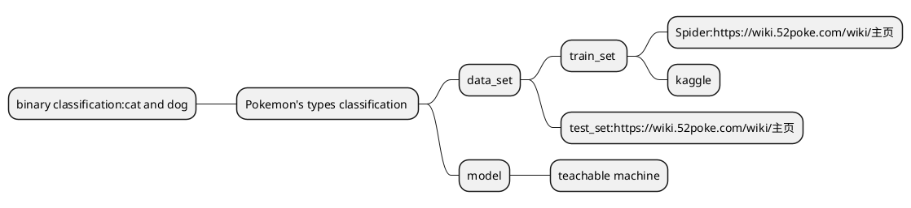

```plantuml
@startmindmap
* Pokemon's types classification 
    ** data_set
        *** train_set 
            **** Spider:https://wiki.52poke.com/wiki/主页
            **** kaggle
        *** test_set:https://wiki.52poke.com/wiki/主页
    ** model
        *** teachable machine
left side
    ** binary classification:cat and dog
@endmindmap
```